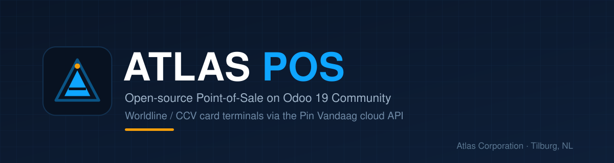
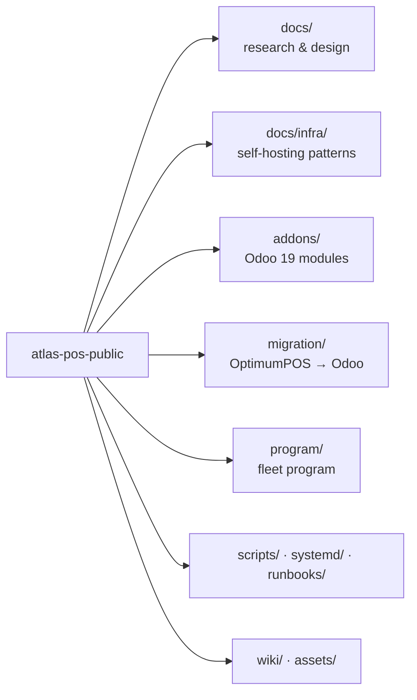

# Atlas POS

**Open-source Point-of-Sale research & components — Odoo 19 Community + Worldline / CCV card terminals via the Pin Vandaag cloud API.**

[Documentation](docs/00-overview.md) · [Diagrams](docs/14-architecture-diagrams.md) · [Wiki](wiki/Home.md) · [Payments](docs/12-payments-landscape.md) · [Modules](#modules)

---

Atlas Corporation builds a Point-of-Sale platform for small Dutch hospitality
and retail venues. We chose **Odoo 19 Community** as the backbone and
**Pin Vandaag / Worldline** cloud terminals for card acceptance — no Odoo
Enterprise, no IoT box. This repository is a **curated, de-identified export**
of the research and code behind it.

> **No credentials, keys, client data or internal infrastructure details are
> included.** Client and infrastructure values are replaced with generic
> placeholders (`venue_a`, `192.0.2.10`, `<TERMINAL-ID>`, …). See
> [`NOTICE.md`](NOTICE.md).

## Why this exists

A lot of "can Odoo Community really run a shop?" has already been answered the
hard way. Rather than let others rediscover it, we publish what we found: which
open-source POS actually supports a card terminal, what Community leaves out,
how to migrate a venue without downtime, and the self-hosting patterns that keep
it running.

## What's inside

| Path | What it is |
|---|---|
| [`docs/`](docs/00-overview.md) | OSS-POS evaluation, Odoo POS landscape (CE vs EE), OCA ecosystem, Pin Vandaag/Worldline integration, payments architecture, migration strategy, security & compliance, device/printing. |
| [`docs/11-oss-pos-projects.md`](docs/11-oss-pos-projects.md) | Open-source POS projects worldwide, with upstream URLs and our verdict. |
| [`docs/12-payments-landscape.md`](docs/12-payments-landscape.md) | Card terminals, PSPs, SoftPOS and open banking. |
| [`docs/13-world-pos-payments-trends.md`](docs/13-world-pos-payments-trends.md) | Market-level POS/payments trends (indicative). |
| [`docs/14-architecture-diagrams.md`](docs/14-architecture-diagrams.md) | Mermaid architecture diagrams. |
| [`docs/infra/`](docs/infra/00-overview.md) | De-identified self-hosting patterns: right-sizing, reversible migrations, backups that restore, SSO front door, hardening, silent-failure ops, LLM routing, incident lessons. |
| [`addons/`](#modules) | Odoo 19 Community modules. |
| [`components/`](components/README.md) | **Non-Odoo parts:** terminal agent, fleet collector, kassa→Odoo sync, Windows harness, onboarding, PCI-scan utils. |
| [`migration/`](migration/MAPPING.md) | Idempotent OptimumPOS → Odoo 19 ETL and mapping. |
| [`program/`](program/PROGRAM.md) | The discover → read-only mirror → replace program. |
| [`scripts/`](scripts/pos-watch.sh) | Fleet watch, read-only mirror, restore verify, provisioning, field playbooks. |
| [`wiki/`](wiki/Home.md) | Condensed wiki pages (also mirrored to the repo wiki). |

## The short version

- **Odoo 19 Community is the only open-source POS we found with a real
  payment-terminal plugin registry.** Restaurant mode ships in Community 19;
  only the IoT/certified-hardware layer is Enterprise.
- **The terminal integration exists.** PIN Vandaag B.V. publishes a free LGPL-3
  Odoo module; we forked it and ported it 17.0 → 19.0
  (`addons/pos_pinvandaag_atlas`).
- **OCA/pos is thin on 19.0** — plan to port modules, not consume them.
- **Java desktop POS** (UniCenta, ChromisPOS, FloreantPOS, POSper) is a poor
  fit: JavaPOS-era printing, no REST terminal layer.
- See [`docs/01-oss-pos-evaluation.md`](docs/01-oss-pos-evaluation.md) for the
  full comparison.

## Architecture (conceptual)

Full diagrams (payment sequence, migration, backups, fleet tiers) are in
[`docs/14-architecture-diagrams.md`](docs/14-architecture-diagrams.md).

## Modules

| Module | Purpose | License |
|---|---|---|
| [`pos_pinvandaag_atlas`](addons/pos_pinvandaag_atlas) | Odoo 19 POS payment terminal via Pin Vandaag REST API v2 (Worldline/CCV). Fork of the official `pos_pinvandaag` 17.0, ported to Odoo 19. | LGPL-3 |
| [`atlas_pos_seed`](addons/atlas_pos_seed) | Additive, idempotent POS provisioning pack: bilingual categories, goods/services, cash + manual card methods, receipt config, language activation. | LGPL-3 |
| [`atlas_pos_theme`](addons/atlas_pos_theme) | Re-brandable backend + login theme scaffold (SCSS variables). | LGPL-3 |

## Documentation index

`00` [Overview](docs/00-overview.md) · `01` [OSS POS evaluation](docs/01-oss-pos-evaluation.md) · `02` [Odoo POS landscape](docs/02-odoo-pos-landscape.md) · `03` [OCA ecosystem](docs/03-oca-pos-ecosystem.md) · `04` [Pin Vandaag integration](docs/04-pinvandaag-integration.md) · `05` [Payments architecture](docs/05-payments-architecture.md) · `06` [Migration strategy](docs/06-migration-strategy.md) · `07` [OptimumPOS gap analysis](docs/07-optimumpos-gap-analysis.md) · `08` [System context](docs/08-system-context.md) · `09` [Security & compliance](docs/09-security-compliance.md) · `10` [Device & printing](docs/10-device-printing.md) · `11` [OSS POS projects](docs/11-oss-pos-projects.md) · `12` [Payments landscape](docs/12-payments-landscape.md) · `13` [World trends](docs/13-world-pos-payments-trends.md) · `14` [Diagrams](docs/14-architecture-diagrams.md)

## Contributing

Issues and pull requests are welcome — especially corrections to the research,
additional open-source POS projects, and Odoo 19 port fixes. Please keep
contributions free of credentials, client data and personal information.

## Attribution

`addons/pos_pinvandaag_atlas` is derived from **`pos_pinvandaag` by PIN Vandaag
B.V.** (LGPL-3). All credit for the API design and original module belongs
upstream. See [`NOTICE.md`](NOTICE.md). Odoo Community and OCA modules are
LGPL-3.

## License

Documentation and tooling: **MIT** (see [`LICENSE`](LICENSE)).
Odoo modules under `addons/`: **LGPL-3**.

## Contact

Atlas Corporation — Tilburg, NL — <https://atlascorporation.nl>
