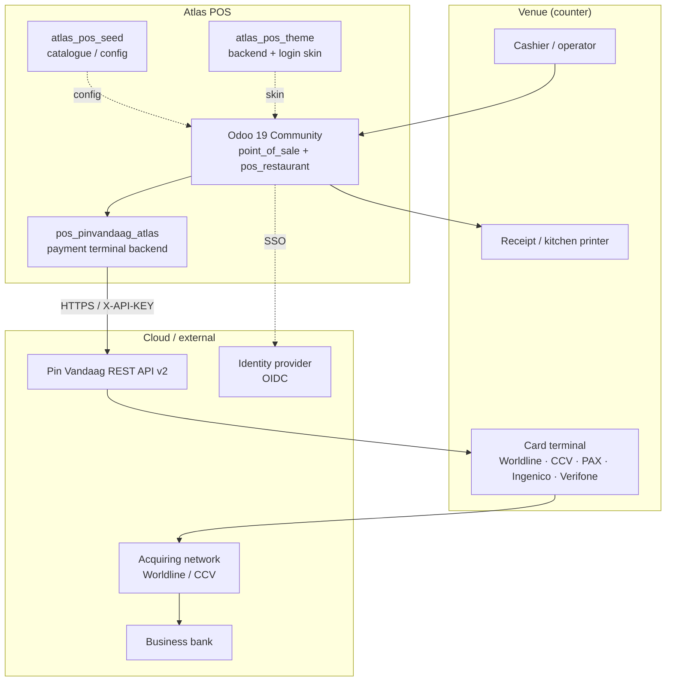
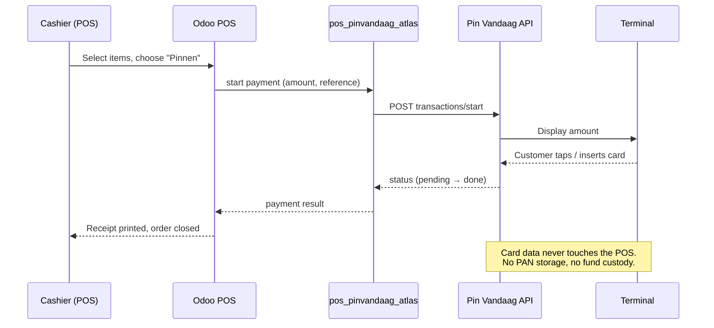
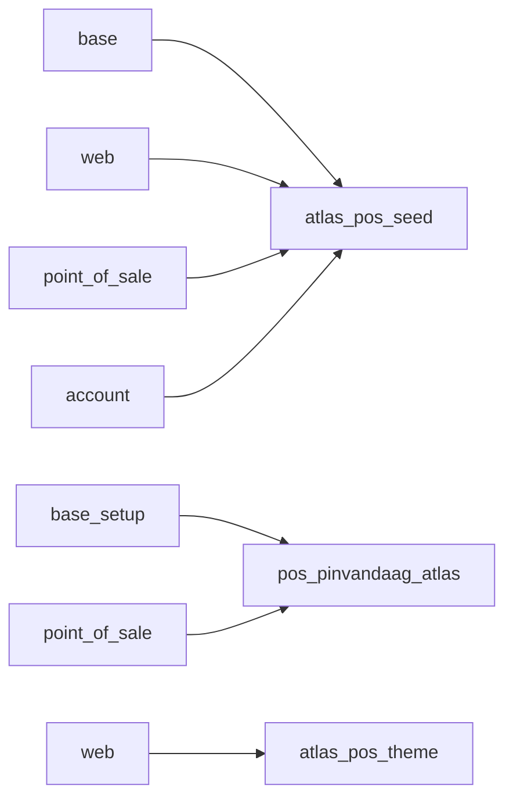
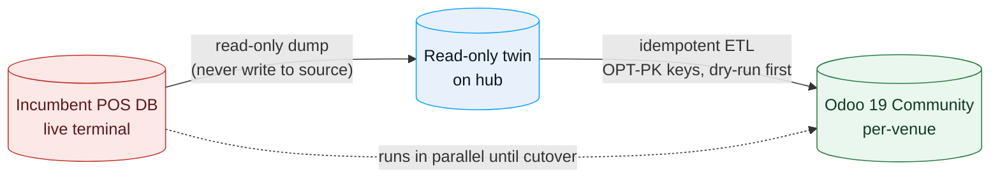
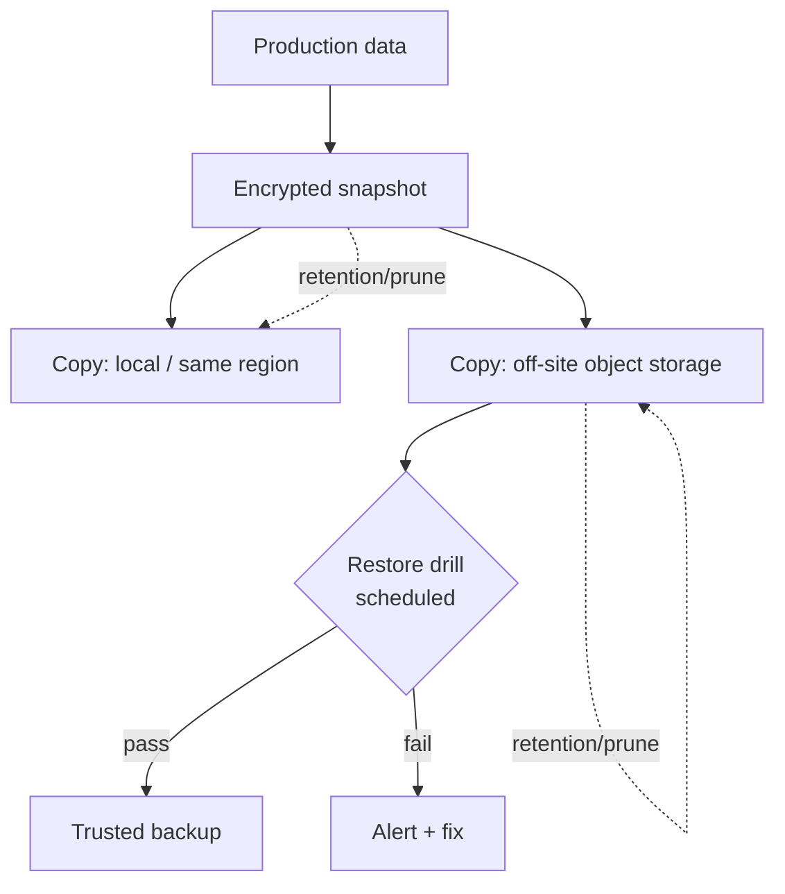
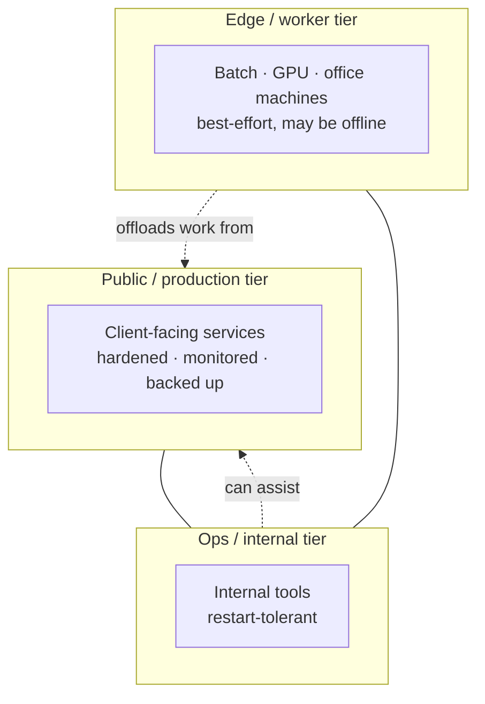
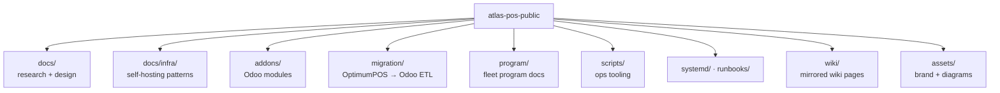

# 14 — Architecture diagrams

All diagrams are [Mermaid](https://mermaid.js.org/) and render natively on
GitHub and Forgejo. They are conceptual — no real addresses, hosts or vendors'
endpoints are shown.

## System context

## Card payment flow (cloud-terminal route)

## Odoo module dependencies

## Migration: bridge-first, read-only twin

## Backups: 3-2-1 with a tested restore

## Fleet tiering

## Repository map

## Rendering locally

Mermaid renders on the host (GitHub/Forgejo). To preview locally, use any
Mermaid-aware Markdown viewer, or paste a block into <https://mermaid.live/>.
