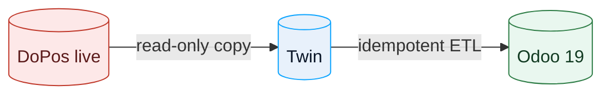

# 17 — DoPos → Odoo migration guide

How Atlas moves a venue off **DoBizzz DoPos** and onto Odoo 19 Community,
without breaking the counter or the customer-facing experience.

## Principle

**Mirror read-only; never write to the live DoPos system.** Discover the data
on a copy, ETL from the copy, and run both systems in parallel until the venue
is comfortable. See `06-migration-strategy.md`.

## Phase 0 — Discovery (read-only)

1. **Edition** — Portable (SQLite file) or Business/Linux (network DB)? This
   decides the extraction method.
2. **Schema** — enumerate tables/columns for orders, order-lines, menu,
   customers, delivery, staff, reservations.
3. **Export** — does DoPos expose a backup/export the venue can trigger? Prefer
   the vendor's own export over reverse-engineering a live file.
4. **Volumes** — how many order rows, menu items, customers.
5. **DPA + quiet window** — signed data-processing agreement; pull only when
   the venue is closed.
6. **PAN check** — confirm no full card numbers are stored (see `pci-scan/`).

> Field names in `migration/` are a **template**. Pin every table/column from a
> real DoPos twin before importing anything.

## Phase 1 — Sell-side parity (catalogue + POS)

| DoPos | Odoo target |
|---|---|
| Menu categories | `pos.category` / `product.category` |
| Articles + prices (eurocents) | `product.template` (`list_price` = cents/100) |
| VAT per article | `account.tax` mapping (NL 21/9/0) |
| All-You-Can-Eat | thin Odoo module or POS config |
| Terminals / users | POS config + `res.users` |

Goal: the counter rings up the same menu at the same prices with the same VAT.

## Phase 2 — Books in the same database

- Map order history / daily totals to Odoo **POS sessions** and journal entries.
- Dutch localization (`l10n_nl`) and the correct BTW before posting anything.
- Reconcile against the venue's bank/PSP settlements.

## Phase 3 — Customer-facing (website + ordering)

- Odoo Website/eCommerce replaces the vendor webshop.
- Own-website order flow into the POS (`pos_sale` / online payment).
- Keep the domain and design so customers see continuity.

## Phase 4 — Delivery & Track & Trace

This is the real gap. Options:

- **Integrate** a delivery module (self-order + delivery + driver app) or
- **Build** a thin tracking page + status notifications (email/SMS/WhatsApp) on
  top of Odoo orders, or
- **Keep** a third-party delivery platform for a transition period.

Do not cut over the customer-facing order rail until status/tracking parity is
delivered — that is the customer's experience.

## Phase 5 — Cut over

- Run DoPos and Odoo in parallel.
- One service at a time; old system **stopped, not deleted**.
- Verify with a real order end-to-end before decommissioning.

## Safety rules

- Read-only credentials on the source.
- Encrypted, PAN-scrubbed mirror.
- Idempotent ETL (`OPT-<PK>`-style keys); **dry-run first**.
- Back up before every write step; verify non-empty.
- Rollback is one command.

## What we do **not** do

- Write to, modify or "clean" the live DoPos database.
- Bulk-import staff logins/secrets.
- Promise delivery/track-and-trace parity before it exists.

## Open items to confirm per venue

Edition + schema; export availability; Thuisbezorgd integration route;
historical-order fidelity; commission terms in force. See
`15-dobizzz-dopos-research.md` §7.
