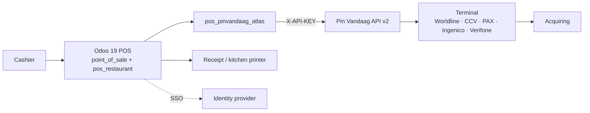

# Architecture

Atlas POS runs on **Odoo 19 Community** and talks to card terminals through a
**cloud REST API** rather than Odoo Enterprise's IoT box.

## Components

## Modules

| Module | Role | Depends on |
|---|---|---|
| `atlas_pos_seed` | Catalogue + config seed (additive, idempotent) | `point_of_sale`, `account` |
| `pos_pinvandaag_atlas` | Payment terminal backend (REST v2) | `point_of_sale` |
| `atlas_pos_theme` | Backend + login skin (SCSS) | `web` |

## Why Community works

- `point_of_sale` and `pos_restaurant` (floors, tables, takeaway) ship in
  Community 19.
- A POS payment method can select a **terminal backend** that talks to a cloud
  PSP. That is the seam the Pin Vandaag module uses.
- Only the IoT/certified-hardware layer is Enterprise.

## Design rules

- **Integrate the payment, never become the acquirer.** No fund custody.
- **Never store card data.** Truncated PANs only, if at all.
- **Per-venue isolation.** One Odoo database per venue; shared code, separate data.
- **Reversible changes.** Migrate one service at a time; keep the old one stopped.

See `docs/14-architecture-diagrams.md` in the repository for the full set.
