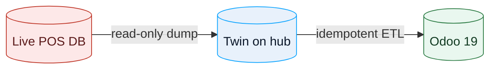

# Migration

Moving a venue off an incumbent POS without downtime. The approach is
**bridge-first**: run the old and new systems in parallel until the venue is
happy.

## Principle

**The live terminal is the source of truth — never write to it.** Mirror it
read-only to a queryable copy (a "twin"), then ETL from the twin into Odoo.

## Steps

1. **Discover** — find the incumbent database, its schema and its exports.
2. **Enrol** — create a scoped, **read-only** DB user on the terminal
   (`runbooks/create-readonly-mysql-user.*`).
3. **Mirror** — pull an encrypted, read-only dump to the twin. Gate it on a
   signed DPA and a quiet window (run when the venue is closed).
4. **Map** — entity-by-entity mapping (`migration/MAPPING.md`).
5. **ETL** — idempotent, `OPT-<PK>` idempotency keys, **dry-run first**
   (`migration/optimumpos_to_odoo.py`).
6. **Parallel run** — both systems live until staff are comfortable.
7. **Cut over** — one service at a time, old system stopped (not deleted).

## Rules

- Never bulk-import staff logins/secrets (`staff.password` etc.) — PII and
  security risk.
- Assert the source is a private-network address before connecting.
- Back up before every write step; verify non-empty backups.
- Rollback must be one command.
