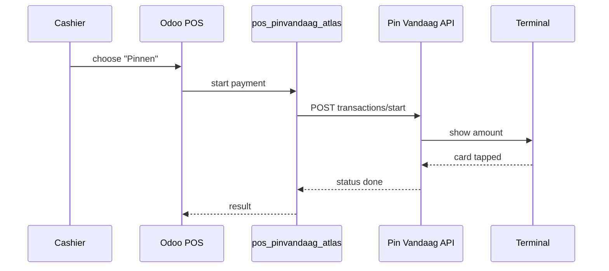

# Payments

Two ways to accept cards from a POS:

1. **Native/certified integration** — POS drives a terminal through the vendor's
   certified integration. In Odoo this is Enterprise-only (IoT box + CTAP/CTEP).
2. **Cloud-terminal REST** — the POS calls the PSP's cloud API, which drives a
   paired terminal. Works on **Community**. This is the route Atlas POS uses.

## Flow (cloud-terminal)

## Providers we evaluated

See `docs/12-payments-landscape.md`. Short version:

- **Pin Vandaag / Worldline** — chosen Community route (free LGPL-3 Odoo module).
- **CCV** — NL acquirer; some integrations in development.
- **Adyen / Stripe** — strong APIs, heavier minimums for a single small venue.
- **Mollie** — great for online orders, not an in-person terminal rail.
- **SumUp / myPOS / Zettle** — simpler bundles, not natively integrated.

## Compliance boundaries

- Never store card data (stay out of PCI scope; SAQ B-IP class).
- Never hold funds or run payouts — the PSP/bank owns settlement.
- Verify webhooks (raw-body signature) and reconcile against settlements.
- No BNPL where interest-bearing products are excluded by policy.

## Terminal hardware

PAX (A77/A920/A960/A35), Ingenico (DX8000/RX5000), Verifone
(V400m/P400/Vx680/Vx820), Worldline (Yomani/Yoximo/Valina), Sunmi Android.
All PCI PTS approved; the differentiator is **who certifies the integration**.
